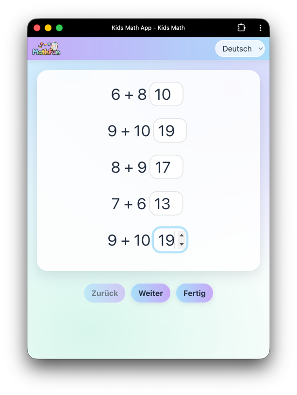
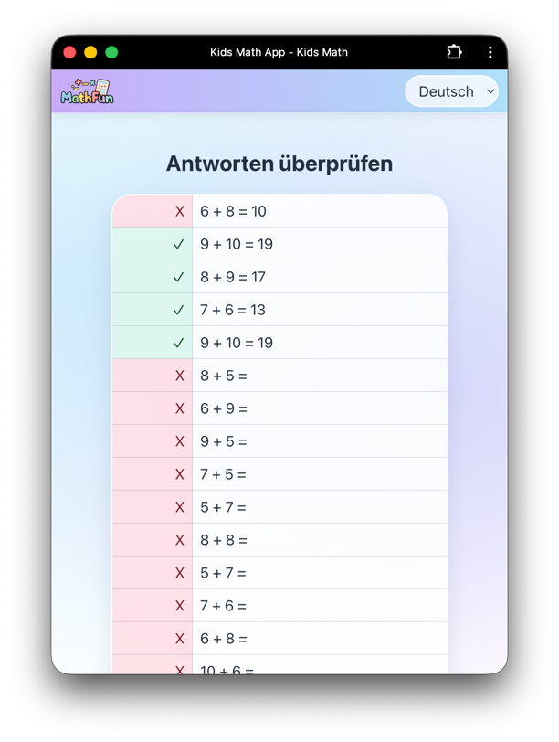
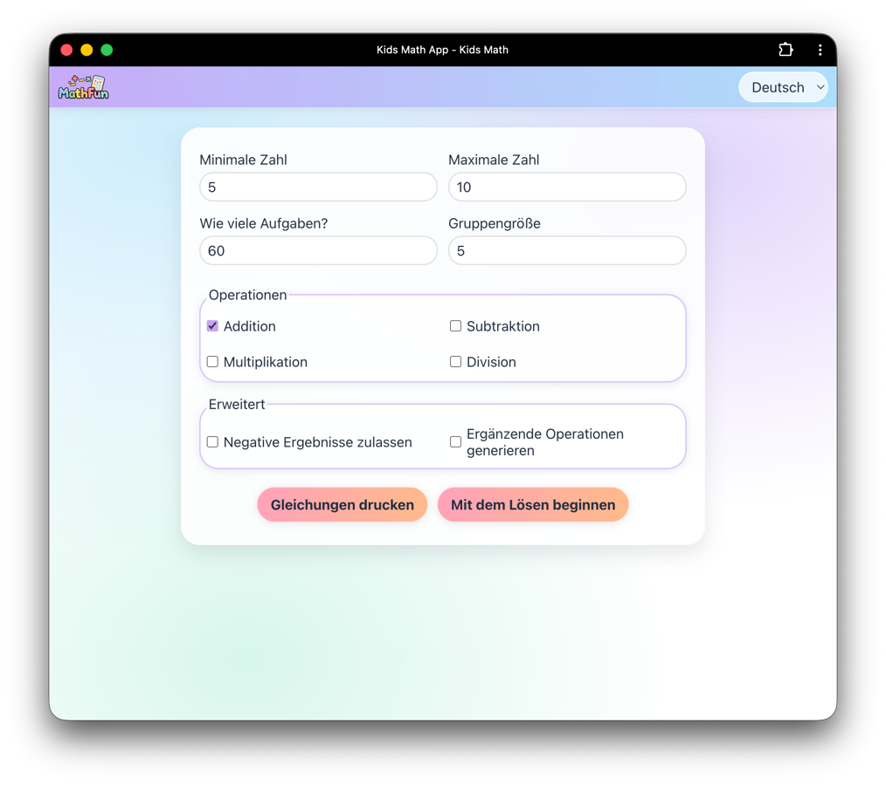

# MathFun — Kids Math App

An interactive math-learning app designed for young learners, focusing on core arithmetic skills through repetition. The project prioritizes clarity, fast feedback, and a distraction-free experience suitable for children

## What it does

- **Configure a practice set**
    - Choose a minimum and maximum number
    - Select how many exercises to generate
    - Adjust group size for how exercises are displayed
    - Pick operations: addition, subtraction, multiplication, division
    - Optional: allow negative results, generate complementary operations

## Practice mode

Work through the generated equations with a clean, distraction-free layout.

- **Keyboard-friendly inputs** for quick entry
- **Navigation controls** to go back/forward and finish when ready

## Review answers

After finishing, the app provides an at-a-glance review so you can quickly see what was correct.

## Responsive UI

The layout is built to work well on both desktop and mobile-sized screens.

